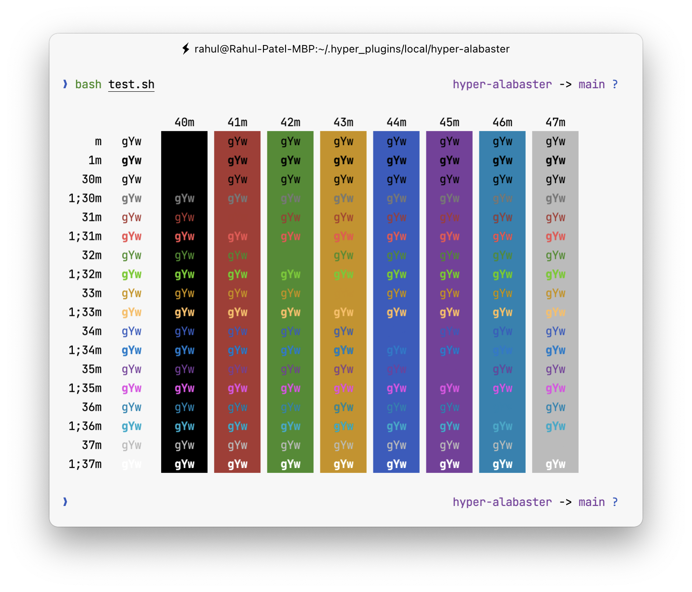

# Alabaster for [Hyper](https://hyper.is)

> [Tonsky's alabaster](https://github.com/tonsky/vscode-theme-alabaster) theme for [Hyper](https://hyper.is).

## Install

Add `hyper-alabaster` to the `plugins` array in your hyper config.

## Tips

The screenshot shown is a combination of the following additional software:

- [Oh My Zsh](https://github.com/robbyrussell/oh-my-zsh)
- [Typewritten Prompt](https://github.com/reobin/typewritten)
- [JetBrain Mono Font](https://www.jetbrains.com/lp/mono/)

## License

[MIT License](./LICENSE)
